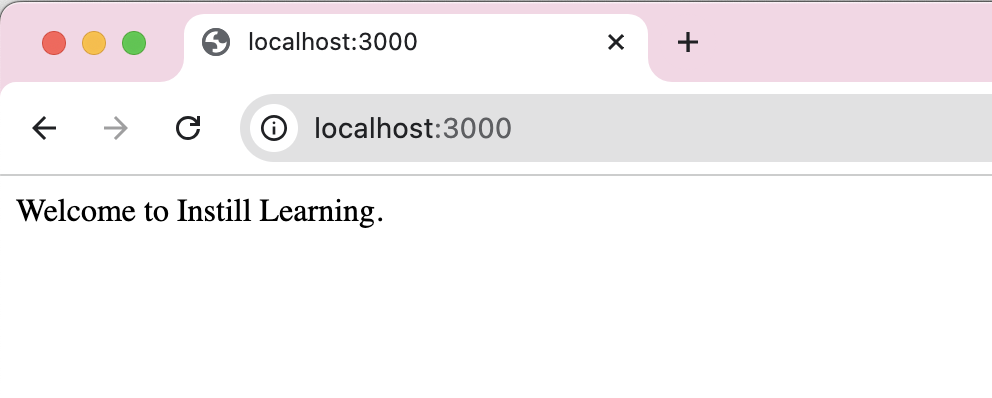

# NextJS15-React19-Training-InstillLearning

# Create a Next.js App Manually

```console
Step 1: Start with this folder or Create a new folder
Step 2: Create a new folder and file: pages --> index.js
Step 3:  add below function to index.js and export them:
```
```javascript
// index.js file
function HomePage() {
    return (<>Welcome to Instill Learning.</>)
}

export default HomePage
```
```console
Step 4: Open terminal and install these librery:
$ npm install next
$ npm install react
$ npm install react-dom
```

```console
Step 5: Write scripts set of scripts in package.json that can be used to automate repetitive tasks:
Below is complete package.json
```
```json
{
  "scripts": {
    "dev": "next dev",
    "build": "next build",
    "start": "next start"
  },
  "dependencies": {
    "next": "^15.0.4",
    "react": "^19.0.0",
    "react-dom": "^19.0.0"
  }
}
```
```console
Step 6: Run the App and see the web app running in browser
$ npm run dev   
```


```console
Step 7: create a public folder and Add favicon
Create a new folder as public and add one favicon icon 
$ mkdir public
```
```console
Step 8: Create a new file at root and configration to nextjs, create new folder as next.config.js
```
```javascript
// next.config.js
const nextConfig = {
    reactStrictMode: true
}
```
```console
Step9: Create _app.js , nextJS create this code internally but still we will create this
```
```javascript
// _app.js
function MyApp({Component, pageProps}) {
    return(<Component {...pageProps}/>)
}

export default MyApp
```