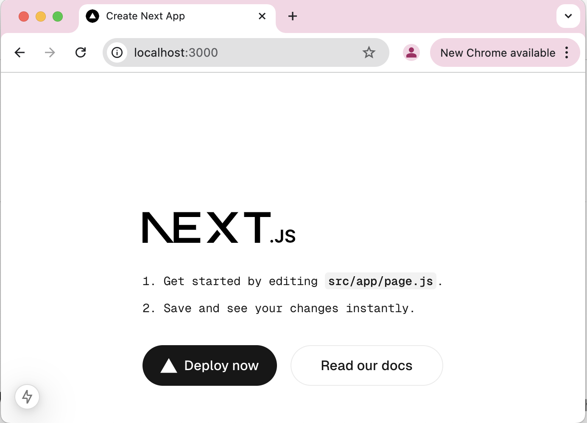

# NextJS15-React19-Training-InstillLearning
```console
Step 1: Create new Next.js App using create-next-app 
$ npx create-next-app@latest

✔ What is your project named? … my-app
✔ Would you like to use TypeScript? … No 
✔ Would you like to use ESLint? … Yes
✔ Would you like to use Tailwind CSS? … No
✔ Would you like your code inside a `src/` directory? … Yes
✔ Would you like to use App Router? (recommended) … Yes
✔ Would you like to use Turbopack for next dev? … Yes
✔ Would you like to customize the import alias (@/* by default)? … No

Here is the package.json, when app created:
```
```json
{
  "name": "my-app",
  "version": "0.1.0",
  "private": true,
  "scripts": {
    "dev": "next dev --turbopack",
    "build": "next build",
    "start": "next start",
    "lint": "next lint"
  },
  "dependencies": {
    "react": "^19.0.0",
    "react-dom": "^19.0.0",
    "next": "15.0.4"
  },
  "devDependencies": {
    "eslint": "^8",
    "eslint-config-next": "15.0.4"
  }
}
```

```console
Step 2: Run the app
$ cd my-app
$ npm run dev
```

